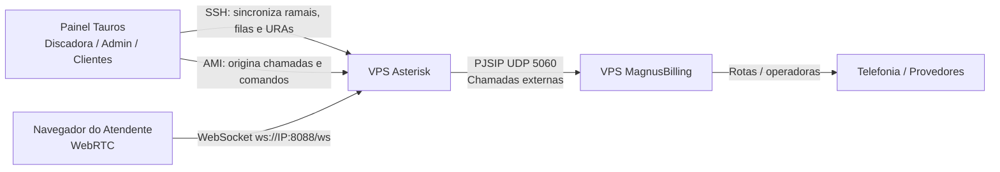
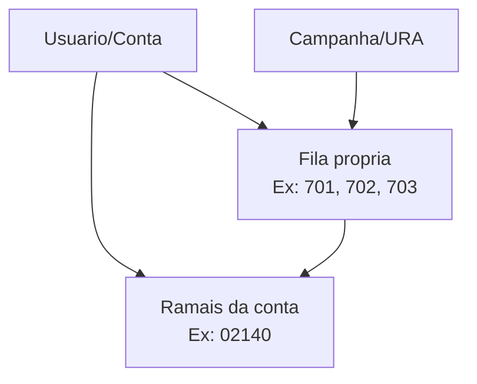

# Guia Completo de Instalacao da VPS Asterisk Tauros

Este guia mostra, passo a passo, como subir uma nova VPS Asterisk para trabalhar com:

- Painel Tauros Discadora.
- MagnusBilling em servidor separado.
- Atendentes WebRTC/SIP.
- Campanhas, URA, URA reversa e filas isoladas por cliente.

O objetivo e permitir reinstalar uma VPS nova sem depender de configuracao manual escondida.

---

## 1. Visao Geral

### Arquitetura



### O que cada servidor faz

| Servidor | Funcao |
|---|---|
| Painel Tauros | Usuarios, campanhas, agendas, audios, filas, saldo, AMI, sincronizacao |
| Asterisk | WebRTC, filas, ramais, URA, discagem e transferencia |
| MagnusBilling | Tarifas, troncos, rotas e saida para operadoras |

---

## 2. Requisitos da VPS Asterisk

### Recomendado

Para operacao real com multiplos clientes:

| Recurso | Minimo | Recomendado |
|---|---:|---:|
| CPU | 2 vCPU | 4 a 8 vCPU |
| RAM | 4 GB | 8 a 16 GB |
| Disco | 40 GB SSD | 80 GB SSD |
| Sistema | Ubuntu 22.04/24.04 ou Debian 12 | Ubuntu 24.04 |
| Rede | IP publico fixo | IP publico fixo |

### Portas usadas

| Porta | Protocolo | Uso |
|---:|---|---|
| 22 | TCP | SSH |
| 5060 | UDP | SIP para Magnus |
| 5038 | TCP | AMI para o painel |
| 8088 | TCP | WebSocket Asterisk |
| 10000-20000 | UDP | RTP/audio |
| 3478 | TCP/UDP | TURN, se ativado |

---

## 3. Dados que voce precisa separar antes

Preencha esta ficha antes de comecar:

| Campo | Exemplo | Onde conseguir |
|---|---|---|
| IP da VPS Asterisk | `IP_PUBLICO_ASTERISK` | Painel da hospedagem |
| IP do painel Tauros | `SEU_IP_DO_PAINEL` | VPS/painel onde roda a discadora |
| IP/host do Magnus | `IP_PUBLICO_MAGNUS` | VPS MagnusBilling |
| Usuario do tronco Magnus | `asmo` | MagnusBilling |
| Senha do tronco Magnus | `********` | MagnusBilling |
| Bina padrao | `18997454428` | Numero autorizado na rota |
| Usuario AMI | `discadora_panel` | Voce escolhe |
| Senha AMI | senha forte | Voce escolhe |
| Usuario TURN | `tauros` | Voce escolhe |
| Senha TURN | senha forte | Voce escolhe |

> Nunca envie o arquivo `tauros.env` preenchido para o GitHub.

---

## 4. Preparar a VPS

Acesse a VPS nova como root:

```bash
ssh root@IP_DA_VPS_ASTERISK
```

Atualize o sistema:

```bash
apt update
apt upgrade -y
apt install -y git curl nano ca-certificates
```

Confira data/hora:

```bash
timedatectl
```

Opcional, ajustar timezone para Sao Paulo:

```bash
timedatectl set-timezone America/Sao_Paulo
```

---

## 5. Baixar o instalador

Na VPS Asterisk:

```bash
cd /root
git clone https://github.com/asmobabilonia-dev/discadora_tauros.git
cd discadora_tauros/asterisk/install
```

Crie o arquivo de configuracao:

```bash
cp tauros.env.example tauros.env
nano tauros.env
```

---

## 6. Preencher o `tauros.env`

Exemplo comentado:

```bash
PUBLIC_IP="IP_PUBLICO_DA_VPS_ASTERISK"

ASTERISK_DOMAIN=""

PANEL_AMI_ALLOW_IP="IP_PUBLICO_DO_PAINEL_TAUROS"

AMI_USER="discadora_panel"
AMI_SECRET="SENHA_FORTE_DO_AMI"
AMI_PORT="5038"

HTTP_PORT="8088"

RTP_START="10000"
RTP_END="20000"

MAGNUS_HOST="IP_DA_VPS_MAGNUS"
MAGNUS_PORT="5060"
MAGNUS_USER="USUARIO_DO_TRONCO_MAGNUS"
MAGNUS_SECRET="SENHA_DO_TRONCO_MAGNUS"
MAGNUS_FROM_USER="USUARIO_DO_TRONCO_MAGNUS"
MAGNUS_FROM_DOMAIN="IP_DA_VPS_MAGNUS"

DEFAULT_CALLERID="BINA_PADRAO_AUTORIZADA"

INSTALL_TURN="1"
TURN_REALM="tauros.local"
TURN_USER="tauros"
TURN_SECRET="SENHA_FORTE_TURN"
TURN_PORT="3478"

CONFIGURE_UFW="1"
```

### Explicacao dos campos principais

| Campo | O que faz |
|---|---|
| `PUBLIC_IP` | IP publico do Asterisk. Usado em RTP, PJSIP e WebRTC |
| `PANEL_AMI_ALLOW_IP` | Apenas esse IP podera conectar no AMI |
| `AMI_USER` / `AMI_SECRET` | Login que o painel usa para enviar comandos ao Asterisk |
| `MAGNUS_HOST` | IP/host do MagnusBilling |
| `MAGNUS_USER` / `MAGNUS_SECRET` | Credencial do tronco PJSIP no Magnus |
| `DEFAULT_CALLERID` | Bina usada quando campanha/URA nao mandar uma bina |
| `INSTALL_TURN` | Instala Coturn para ajudar WebRTC atras de NAT |

---

## 7. Executar a instalacao

Depois de salvar o `tauros.env`:

```bash
sudo bash install_asterisk_tauros.sh tauros.env
```

O instalador vai:

1. Instalar Asterisk e dependencias.
2. Fazer backup de `/etc/asterisk`.
3. Configurar WebSocket HTTP.
4. Configurar RTP/ICE.
5. Configurar AMI.
6. Criar certificado DTLS.
7. Configurar tronco PJSIP para Magnus.
8. Criar includes do painel.
9. Configurar Coturn, se ativado.
10. Configurar firewall UFW, se ativado.
11. Reiniciar o Asterisk.
12. Mostrar comandos de conferencia.

---

## 8. Conferir se instalou certo

### Ver versao do Asterisk

```bash
asterisk -rx "core show version"
```

Esperado:

```text
Asterisk ... built ...
```

### Conferir WebSocket

```bash
asterisk -rx "http show status"
```

Esperado:

```text
Server Enabled and Bound to 0.0.0.0:8088
/ws => Asterisk HTTP WebSocket
```

### Conferir transportes PJSIP

```bash
asterisk -rx "pjsip show transports"
```

Esperado:

```text
transport-udp  udp  0.0.0.0:5060
transport-ws   ws   0.0.0.0:8088
```

### Conferir AMI

```bash
asterisk -rx "manager show settings"
asterisk -rx "manager show user discadora_panel"
```

Esperado:

```text
Manager (AMI): Yes
TCP Bindaddress: 0.0.0.0:5038
```

E no usuario:

```text
username: discadora_panel
secret: <Set>
ACL: yes
```

### Conferir tronco Magnus

```bash
asterisk -rx "pjsip show endpoint magnus"
```

Esperado:

```text
Endpoint: magnus
OutAuth: magnus-auth
Contact: magnus-aor/sip:IP_DO_MAGNUS:5060
```

---

## 9. Configurar o painel Tauros

No painel Tauros, entre como administrador e abra **Configuracoes**.

### Configurar Asterisk SSH

Preencha:

| Campo | Valor |
|---|---|
| Host SSH Asterisk | IP da VPS Asterisk |
| Usuario SSH | `root` |
| Chave SSH | caminho da chave usada pelo painel |
| IP externo Asterisk | IP da VPS Asterisk |

O painel usa SSH para publicar:

- Ramais WebRTC.
- Filas por usuario.
- URAs.
- Dialplan de transferencia.

### Configurar AMI

Preencha:

| Campo | Valor |
|---|---|
| AMI Host | IP da VPS Asterisk |
| AMI Porta | `5038` |
| AMI Usuario | `discadora_panel` |
| AMI Senha | mesma senha de `AMI_SECRET` |
| Timeout | `5` |

Clique em **Testar conexao AMI**.

Esperado:

```text
Conexao AMI realizada com sucesso.
```

---

## 10. Sincronizar ramais, filas e URAs

Depois que o painel estiver apontando para a VPS nova:

1. Abra **Ramais**.
2. Confira os ramais dos usuarios.
3. Clique para sincronizar, se houver botao.
4. Abra **Filas**.
5. Crie ou confira filas por conta.
6. Clique em sincronizar filas.
7. Abra **URA** e **URA Reversa**.
8. Sincronize os fluxos.

### Como fica no Asterisk



Cada cliente deve ter fila propria. Nao use fila global `700`.

---

## 11. Testar atendente WebRTC

Abra a URL do atendente no navegador:

```text
http://SEU_PAINEL/discadora/?page=agent_phone&extension=RAMAL&password=SENHA
```

Clique em conectar/registrar.

Na VPS Asterisk, confira:

```bash
asterisk -rx "pjsip show endpoints"
```

Esperado:

```text
Endpoint: RAMAL ... Not in use
Contact: ... Avail
```

Se aparecer `Unavailable`, o ramal nao esta registrado.

---

## 12. Testar chamada de saida

No painel:

1. Configure um SIP/tronco.
2. Configure bina autorizada.
3. Abra uma campanha pequena ou URA reversa.
4. Disque para um numero seu.

Na VPS Asterisk, acompanhe:

```bash
asterisk -rvvv
```

Ou em outro terminal:

```bash
tail -f /var/log/asterisk/full
```

Ver chamadas ativas:

```bash
asterisk -rx "core show channels concise"
```

---

## 13. Testar transferencia para fila

Com o atendente online:

1. Faça uma chamada de campanha ou URA reversa.
2. Atenda no telefone externo.
3. O Asterisk deve jogar para a fila da conta.
4. O ramal do atendente deve tocar.

Conferir filas:

```bash
asterisk -rx "queue show"
```

Esperado:

```text
discadora_usuario_...
Members:
  Nome (PJSIP/RAMAL) (Not in use)
Callers:
```

Se o ramal estiver `Unavailable`, ele nao vai tocar.

---

## 14. Diagnostico rapido

### AMI nao conecta

Verificar:

```bash
asterisk -rx "manager show settings"
asterisk -rx "manager show user discadora_panel"
ss -lntp | grep 5038
```

Causas comuns:

- IP do painel diferente de `PANEL_AMI_ALLOW_IP`.
- Firewall bloqueando 5038.
- Senha AMI errada no painel.

### WebRTC nao registra

Verificar:

```bash
asterisk -rx "http show status"
asterisk -rx "pjsip show transports"
asterisk -rx "pjsip show endpoints"
```

Causas comuns:

- URL WebSocket errada.
- Porta 8088 bloqueada.
- Certificado/DTLS ausente.
- Ramal ainda nao sincronizado pelo painel.

### Chamada atende e cai

Verificar:

```bash
tail -f /var/log/asterisk/full
asterisk -rx "core show channels concise"
asterisk -rx "pjsip show endpoint magnus"
```

Causas comuns:

- Magnus recusando chamada.
- Bina nao autorizada.
- Rota sem saldo.
- Audio WAV incompativel.
- Dialplan de URA nao sincronizado.

### Atendente nao toca

Verificar:

```bash
asterisk -rx "queue show"
asterisk -rx "pjsip show endpoint RAMAL"
```

Causas comuns:

- Ramal `Unavailable`.
- Fila sem membros.
- Cliente usando fila errada.
- Painel nao sincronizou filas.

---

## 15. Audios WAV para URA

Para evitar chamada cair ao tocar audio, use audio compatível:

```bash
ffmpeg -i entrada.mp3 -ar 8000 -ac 1 -c:a pcm_s16le saida.wav
```

Coloque o arquivo no local esperado pelo painel/Asterisk e sincronize a URA.

Formato recomendado:

| Campo | Valor |
|---|---|
| Sample rate | 8000 Hz |
| Canais | Mono |
| Codec | PCM 16-bit |
| Extensao | `.wav` |

---

## 16. Backup e snapshot sanitizado

Para salvar um snapshot sem senhas:

```bash
cd /root/discadora_tauros/asterisk
sudo bash scripts/collect_sanitized_snapshot.sh /root/asterisk-snapshot
```

Esse snapshot remove senhas de arquivos sensiveis.

Backup bruto da configuracao:

```bash
tar -czf /root/asterisk-backup-$(date +%F).tar.gz /etc/asterisk
```

Nao envie backup bruto para GitHub, pois pode conter senhas.

---

## 17. Checklist final de liberacao

Antes de entregar a VPS:

- [ ] `core show version` responde.
- [ ] `http show status` mostra `/ws`.
- [ ] `pjsip show transports` mostra `transport-udp` e `transport-ws`.
- [ ] `manager show user discadora_panel` mostra ACL para IP do painel.
- [ ] Painel testa AMI com sucesso.
- [ ] Painel sincroniza ramais sem erro.
- [ ] `pjsip show endpoints` mostra ramais.
- [ ] Atendente registra e fica `Avail`.
- [ ] `queue show` mostra filas por conta.
- [ ] Nao existe fila global `700` sendo usada em producao.
- [ ] Chamada de teste toca no destino.
- [ ] Ao atender, transfere para a fila correta.
- [ ] Bina aparece correta.
- [ ] Audio de URA toca sem derrubar.
- [ ] Magnus completa chamada pela rota correta.

---

## 18. Comandos uteis

```bash
systemctl status asterisk
systemctl restart asterisk
asterisk -rvvv
asterisk -rx "core reload"
asterisk -rx "pjsip reload"
asterisk -rx "dialplan reload"
asterisk -rx "queue reload all"
asterisk -rx "queue show"
asterisk -rx "core show channels concise"
asterisk -rx "pjsip show endpoints"
asterisk -rx "http show status"
asterisk -rx "manager show settings"
tail -f /var/log/asterisk/full
```

---

## 19. Atualizar instalador no futuro

Na VPS:

```bash
cd /root/discadora_tauros
git pull
cd asterisk/install
sudo bash install_asterisk_tauros.sh tauros.env
```

O instalador sempre faz backup de `/etc/asterisk` antes de aplicar alteracoes.
